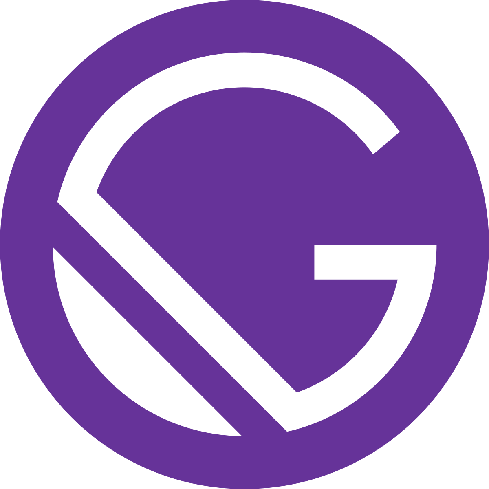

<!-- AUTO-GENERATED-CONTENT:START (STARTER) -->
<h1 align="center">
  Bruno Aurichio Esposito Website
</h1>

## 🚀 Getting Start

This site was designed and programmed with the intention of having an online page with my skills. A way of spreading new technologies and, who knows, encouraging someone to do the same 😉

## 👨‍💻 Technology

 
 

##  Learning Gatsby

Looking for more guidance? Full documentation for Gatsby lives [on the website](https://www.gatsbyjs.org/). Here are some places to start:

- **For most developers, we recommend starting with our [in-depth tutorial for creating a site with Gatsby](https://www.gatsbyjs.org/tutorial/).** It starts with zero assumptions about your level of ability and walks through every step of the process.

- **To dive straight into code samples, head [to our documentation](https://www.gatsbyjs.org/docs/).** In particular, check out the _Guides_, _API Reference_, and _Advanced Tutorials_ sections in the sidebar.

##  Learning ReactJS

You can find the React documentation [on the website](https://reactjs.org/docs).  

Check out the [Getting Started](https://reactjs.org/docs/getting-started.html) page for a quick overview.

The documentation is divided into several sections:

* [Tutorial](https://reactjs.org/tutorial/tutorial.html)
* [Main Concepts](https://reactjs.org/docs/hello-world.html)
* [Advanced Guides](https://reactjs.org/docs/jsx-in-depth.html)
* [API Reference](https://reactjs.org/docs/react-api.html)
* [Where to Get Support](https://reactjs.org/community/support.html)
* [Contributing Guide](https://reactjs.org/docs/how-to-contribute.html)

You can improve it by sending pull requests to [this repository](https://github.com/reactjs/reactjs.org).